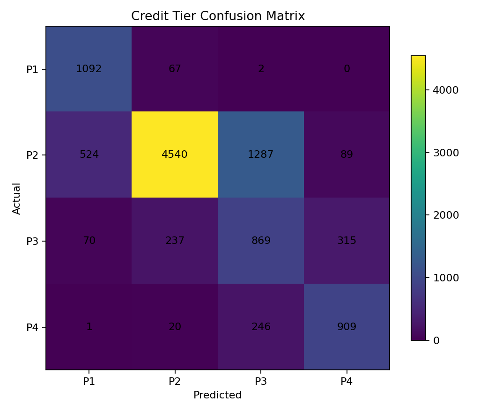
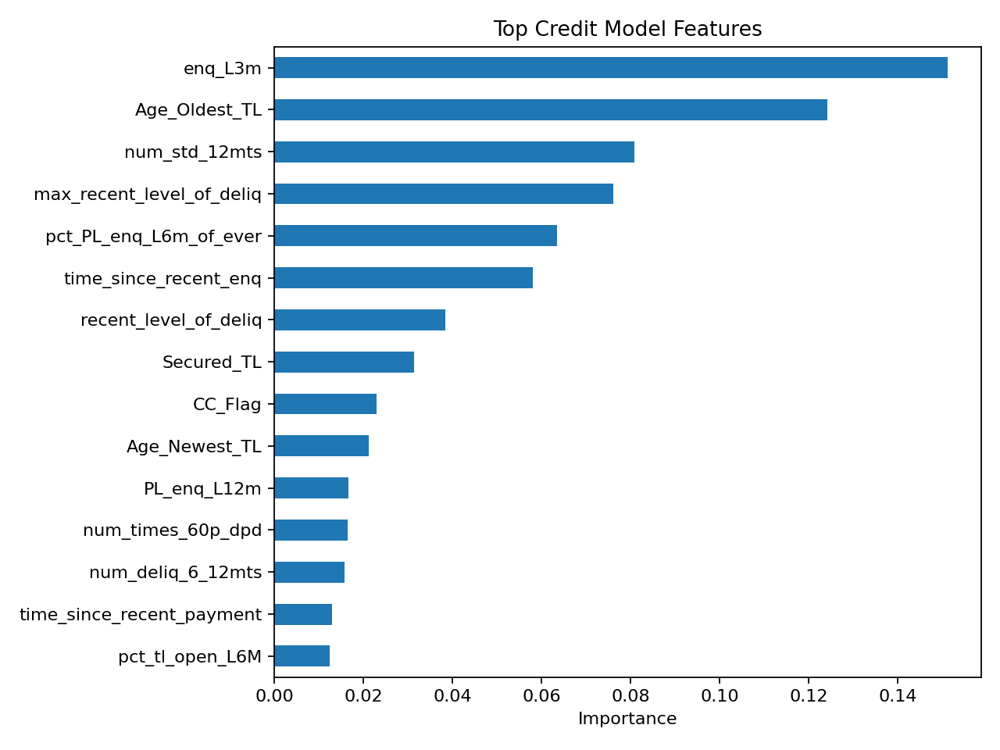
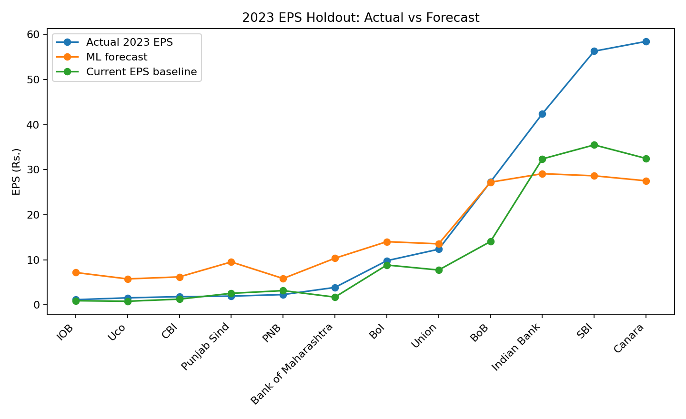
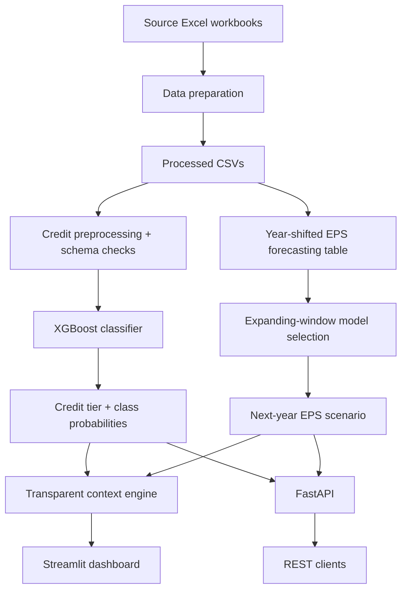

# Banking Risk & Financial Intelligence

> **An integrated banking analytics platform for customer credit-tier assessment, one-year EPS forecasting, and transparent portfolio context.**

[](https://www.python.org/)
[](https://xgboost.readthedocs.io/)
[](https://streamlit.io/)
[](https://fastapi.tiangolo.com/)
[](https://pytest.org/)

## Tech stack

### Languages & core engineering
- **Python 3.11+** — application, data preparation, modeling, APIs and tests
- **Git / GitHub** — version control and repository-based deployment

### Data & machine learning
- **Pandas** — tabular data loading, cleaning, joins and feature preparation
- **NumPy** — numerical computation
- **scikit-learn** — preprocessing, train/test splitting, cross-validation and evaluation
- **XGBoost** — credit-tier classification and EPS regression
- **Joblib** — model serialization and deployment artifacts
- **OpenPyXL** — Excel workbook ingestion

### Application & deployment
- **Streamlit** — interactive portfolio dashboard
- **FastAPI** — REST API layer
- **Uvicorn** — ASGI server for the API
- **Pydantic** — typed request/response validation
- **Render** — API deployment configuration
- **Streamlit Community Cloud** — dashboard deployment target

### Visualization & quality
- **Matplotlib** — evaluation plots and reporting visuals
- **pytest** — automated regression/API tests
- **GitHub Actions** — continuous integration

### Project architecture
The stack is intentionally lightweight: Python handles the end-to-end ML workflow, XGBoost provides the predictive models, Streamlit provides the user-facing dashboard, and FastAPI exposes the same model artifacts through programmatic endpoints.

## Why this project exists

Banks operate at two very different analytical levels:

1. **Customer level:** understand an applicant's credit behaviour and place the applicant into an appropriate credit/approval tier.
2. **Institution level:** understand how the bank's financial performance is evolving and what its near-term EPS could look like.

These questions are related from a risk-management perspective, but they are **not the same prediction problem**. This project keeps the two modeling tasks separate and then connects them through an explicit, auditable context layer.

The result is a small but complete banking decision-support system:

```text
                    BANKING DATA
                         │
          ┌──────────────┴──────────────┐
          │                             │
   CUSTOMER CREDIT DATA           BANK FINANCIAL DATA
          │                             │
          ▼                             ▼
   Credit-tier model              EPS forecast model
          │                             │
          ▼                             ▼
     P1 / P2 / P3 / P4           Next-year EPS scenario
     + class probabilities       + growth vs current EPS
          │                             │
          └──────────────┬──────────────┘
                         ▼
             TRANSPARENT CONTEXT LAYER
                         │
                         ▼
        Streamlit dashboard / FastAPI API
```

## Project problem statement

Banks have large amounts of customer credit information but often analyse customer-level lending risk and institution-level financial performance in separate workflows. This makes it harder to put an applicant's credit profile into the broader context of portfolio and institutional conditions.

This project develops a unified analytical platform that:

- classifies customers into the four approval/priority tiers available in the supplied credit dataset;
- exposes class probabilities rather than only a hard class;
- forecasts one-year-ahead bank EPS using current-year financial indicators;
- benchmarks the EPS model against a simple current-EPS carry-forward baseline;
- surfaces both model outputs together through a transparent scenario layer; and
- exposes the resulting models through a web dashboard and REST API.

## What makes this version different from a typical tutorial

This repository intentionally fixes several common machine-learning project weaknesses:

**No test-set hyperparameter tuning.** The credit model is tuned only inside training folds. The EPS workflow uses earlier target years for model selection and keeps 2023 untouched for final evaluation.

**No training/deployment preprocessing mismatch.** The fitted credit preprocessing and classifier are saved as one joblib pipeline. The app and API call the same artifact.

**No arbitrary ordinal encoding for nominal categories.** Credit categorical fields are one-hot encoded inside the pipeline.

**Deployment-schema parity.** The deployable credit model uses the exact feature family shared with the supplied unseen-applicant schema, and `Credit_Score` is deliberately excluded from that production-facing artifact because it is absent from the unseen data.

**Baseline-first financial forecasting.** The EPS model is not declared successful simply because it is an ML model. On the final holdout, a simple current-EPS baseline is stronger, and the application makes that limitation visible.

**Explicit model semantics.** The credit target is treated as a four-level approval/priority classification task, not misrepresented as a calibrated probability-of-default model. Public write-ups of the same case-study dataset commonly interpret P1 as the lower-risk/easier-credit tier and P4 as the highest-risk/least-suitable tier; this repository treats that as a configurable case-study convention rather than an official bank policy. See: https://doi.org/10.1051/itmconf/20257001012

## Data used

The supplied ZIP contained two credit workbooks, a feature dictionary, an unseen-applicant dataset, and a separate annual bank financial dataset.

### Customer credit data

- `case_study1.xlsx` — internal/bureau tradeline and account history
- `case_study2.xlsx` — delinquency, enquiries, customer profile and credit variables
- 51,336 common customer IDs
- 87 columns after the merge, before modeling filters
- Four target classes: P1, P2, P3, P4
- The source uses `-99999` as a missing-value sentinel

The target distribution is imbalanced, with P2 being the dominant class. This is why the project reports **macro F1** and **balanced accuracy** in addition to accuracy.

### Bank financial data

`EPS_Dataset.xlsx` contains:

- 12 banks
- years 2019–2023
- 60 bank-year observations
- profitability, operating, balance-sheet and efficiency indicators
- Basic EPS as the target variable

## Modeling approach

### 1. Credit-tier classification

The credit workflow is:

```text
case_study1 + case_study2
          ↓
inner join on PROSPECTID
          ↓
replace -99999 with NaN
          ↓
remove variables with >30% missingness
          ↓
restrict to unseen-schema-compatible features
          ↓
80/20 stratified split
          ↓
train-fold-only model selection
          ↓
median imputation + one-hot encoding
          ↓
XGBoost multiclass classifier
          ↓
P1/P2/P3/P4 + probabilities
```

The deployable model uses **42 features**. Five categorical columns are one-hot encoded; numerical values are median-imputed inside the saved pipeline.

### 2. One-year EPS forecasting

The original supplied exercise used same-year inputs to predict same-year EPS. That is not a genuine forecast.

This version changes the task to:

```text
Current-year bank indicators
          ↓
Predict next-year EPS
```

For each bank, the target is shifted by one year:

```text
2019 indicators → predict 2020 EPS
2020 indicators → predict 2021 EPS
2021 indicators → predict 2022 EPS
2022 indicators → predict 2023 EPS
2023 indicators → can be used for a 2024 scenario
```

The 2023 target-year observations are kept as the final holdout. Model selection is performed only on earlier years.

The chosen model for the supplied data is a **Random Forest regressor**. The project also evaluates a carry-forward baseline:

```text
baseline forecast = current EPS
```

This baseline is important because EPS is highly persistent in the supplied sample.

### 3. Combined context layer

The two predictive models are **not** forced into a fake single model.

Instead:

```text
Customer credit tier
        +
Bank EPS scenario
        ↓
Transparent scenario context
```

The context layer can flag situations such as:

- higher-attention customer tier;
- negative bank financial outlook; or
- a combination that merits closer review.

This is an explicit business rule, not a learned underwriting policy.

## Results on the supplied data

### Credit model

Final 20% stratified holdout:

| Metric | Result |
|---|---:|
| Accuracy | **72.17%** |
| Balanced Accuracy | **75.03%** |
| Macro F1 | **0.687** |
| Weighted F1 | **0.739** |
|

Class-level performance is intentionally reported because the P2 class dominates the sample.





### EPS forecast model

Final 2023 target-year holdout:

| Metric | ML model | Current-EPS baseline |
|---|---:|---:|
| MAE | 9.13 | **6.73** |
| RMSE | 13.24 | **10.84** |
| R² | 0.611 | **0.739** |

The ML model does **not** beat the simple baseline on this dataset. That is a documented limitation and a deliberate part of the project's model-governance story.



## Engineering architecture



## Live demo

After deployment, place the public Streamlit URL here:

```text
https://YOUR-APP.streamlit.app
```

The repository is already configured for the Streamlit entrypoint `app/streamlit_app.py`.

## Repository structure

```text
Banking_Risk_Financial_Intelligence/
│
├── README.md
├── requirements.txt
├── pyproject.toml
├── Makefile
├── render.yaml
├── run_app.bat
├── run_api.bat
│
├── app/
│   ├── README.md
│   └── streamlit_app.py
│
├── api/
│   ├── README.md
│   └── main.py
│
├── src/
│   ├── config.py
│   ├── data/
│   │   ├── credit.py
│   │   └── eps.py
│   ├── models/
│   │   ├── credit.py
│   │   ├── decision_engine.py
│   │   └── eps.py
│   └── utils/
│       └── io.py
│
├── scripts/
│   ├── prepare_data.py
│   ├── train_credit.py
│   ├── train_eps.py
│   └── train_all.py
│
├── data/
│   ├── raw/                # source workbooks; gitignored
│   ├── processed/          # generated training CSVs; gitignored
│   └── sample/             # small/demo inputs used by the app
│
├── artifacts/
│   ├── credit_tier_model.joblib
│   ├── credit_metadata.json
│   ├── eps_forecast_model.joblib
│   ├── eps_metadata.json
│   └── bank_latest_reference.csv
│
├── reports/
│   ├── figures/
│   ├── metrics/
│   ├── unseen_credit_scores.csv
│   ├── eps_2023_holdout_predictions.csv
│   └── forecast_2024_demo.csv
│
├── docs/
│   ├── architecture.md
│   ├── credit_model_card.md
│   ├── data_dictionary.md
│   ├── eps_model_card.md
│   └── reproducibility.md
│
├── notebooks/
│   ├── 01_credit_risk_overview.ipynb
│   └── 02_eps_forecasting_overview.ipynb
│
├── tests/
│   └── test_project.py
│
└── .github/
    └── workflows/
        └── ci.yml
```

## Local setup

### Windows

The project targets Python 3.11 for reproducible local and API deployment environments.

```powershell
py -3.11 -m venv .venv
.\.venv\Scripts\Activate.ps1
python -m pip install --upgrade pip
pip install -r requirements.txt
```

### Prepare the supplied workbooks

Place the source workbooks in `data/raw/` and run:

```bash
python -m scripts.prepare_data
```

The prepared CSVs go to `data/processed/`.

### Train the complete system

```bash
python -m scripts.train_credit
python -m scripts.train_eps
```

or:

```bash
python -m scripts.train_all
```

### Test

```bash
pytest -q
```

### Run the dashboard

```bash
streamlit run app/streamlit_app.py
```

### Run the API

```bash
uvicorn api.main:app --reload
```

Interactive API docs are then available at `/docs`.

## Deployment recommendation

### Primary deployment: Streamlit Community Cloud

For this project, the **best portfolio-facing deployment is Streamlit Community Cloud** because the user-facing product is a data/ML dashboard and the deployment workflow is directly connected to GitHub. Streamlit's official deployment flow lets you select a repository, branch and entrypoint, and deployed apps receive a shareable `streamlit.app` URL. See the [Streamlit Community Cloud deployment documentation](https://docs.streamlit.io/deploy/streamlit-community-cloud/deploy-your-app/deploy).

Recommended repo entrypoint:

```text
app/streamlit_app.py
```

Recommended public flow:

```text
GitHub repository
       ↓
Streamlit Community Cloud
       ↓
Public interactive dashboard
       ↓
README + LinkedIn + resume
```

Streamlit also documents GitHub-based updates, so pushes to the repository can flow into the deployed app. See the [Streamlit GitHub integration documentation](https://docs.streamlit.io/deploy/streamlit-community-cloud/get-started/connect-your-github-account).

### Secondary deployment: Render for the API

The repository also contains a FastAPI service and a `render.yaml`. A `.python-version` file pins the service to Python 3.11 instead of relying on Render's changing platform default. Render supports selecting a Python version via `.python-version` and documents the FastAPI/Uvicorn deployment pattern. See the [Render FastAPI deployment documentation](https://render.com/docs/deploy-fastapi).

For a resume, the strongest presentation is therefore:

**GitHub → Streamlit dashboard → optional live FastAPI endpoint.**

Hugging Face Spaces is another viable option for ML demos, but its current documentation recommends the Docker SDK for Streamlit rather than the deprecated built-in Streamlit SDK. For this particular repository, that adds deployment complexity without a clear portfolio benefit. See the [Hugging Face Streamlit Spaces documentation](https://huggingface.co/docs/hub/main/spaces-sdks-streamlit).

## Production-readiness notes

This is a portfolio/research implementation, not a regulated lending system.

Important boundaries:

- `Approved_Flag` is a case-study approval/priority label, not an observed future default event.
- The credit model should not be described as a calibrated PD model without outcome labels and probability calibration.
- The current EPS dataset has only 12 banks × 5 years, which is too small for broad claims about financial forecasting.
- The 2024 EPS values in `reports/forecast_2024_demo.csv` are **scenario forecasts** because the supplied data ends at 2023.
- The combined layer is a transparent context rule, not automated underwriting.
- Real deployment would require governance around fairness, model monitoring, auditability, drift, data retention, and regulatory requirements.

## What I would say in an interview

> **I built an integrated banking analytics platform with two intentionally separate predictive layers. The first classifies customers into four credit tiers using 42 features from internal and bureau-style data, with an XGBoost pipeline and class-probability outputs. The second converts annual bank data into a genuine one-year-ahead EPS forecasting task and evaluates ML against a carry-forward EPS baseline. I then connected the outputs through an explicit scenario layer and deployed the system with Streamlit and FastAPI. A major part of the project was model discipline: keeping the test set untouched, maintaining training/deployment preprocessing parity, and documenting cases where the ML model did not beat a simple baseline.**

## Future extensions

The next major upgrade would be to replace the approval-tier target with an actual future credit outcome such as default within a defined horizon. With that target, the platform could support PD estimation, probability calibration, expected loss using **ECL = PD × LGD × EAD**, and more defensible credit-policy analysis.

Other possible extensions include temporal credit datasets, richer bank fundamentals, external macroeconomic variables, model monitoring, SHAP-based explanations, automated data-quality checks, and role-based access control.

## License

The source code in this repository is released under the MIT License. The supplied datasets/source workbooks may be subject to separate ownership or redistribution terms; they are therefore excluded from Git by default.
