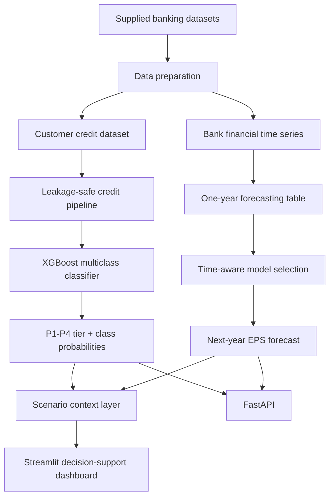

# Architecture

## Design choices

### Credit side
The deployable model uses only features shared with the supplied unseen-applicant schema. `Credit_Score` is intentionally excluded from this production-facing artifact because it is absent from that schema. Missing values are handled inside the fitted preprocessing pipeline, and categorical variables use one-hot encoding rather than arbitrary ordinal codes.

### Financial side
The target is shifted one year forward within each bank. A 2023 target-year holdout is kept untouched for the final evaluation. Hyperparameter/model selection is performed on earlier years only. A carry-forward-current-EPS baseline is reported next to the ML model so the project does not claim ML value where the dataset does not support it.

### Combined layer
The combined layer is deliberately **not another ML model**. It is a transparent scenario/communication rule that puts customer credit tier and bank financial outlook side by side. It must not be presented as an automated loan-approval policy.
